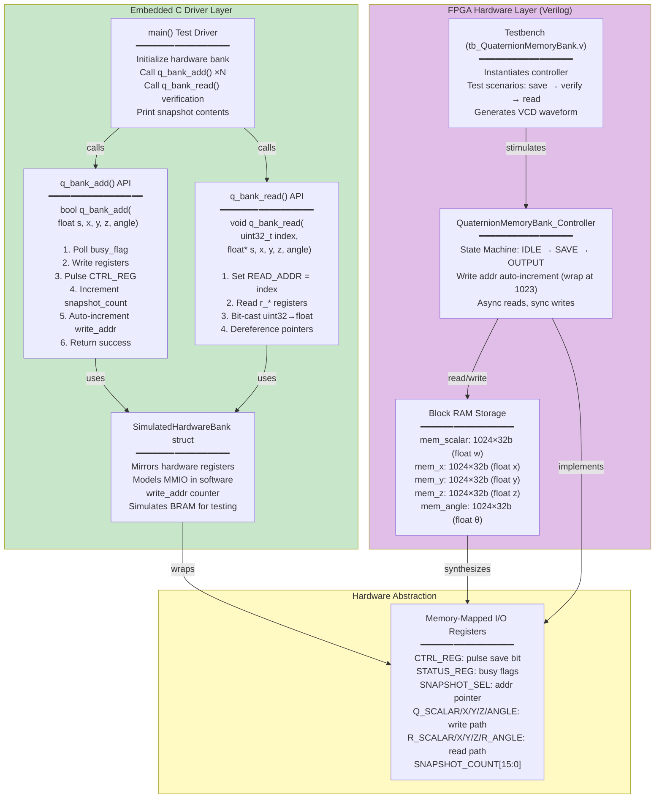
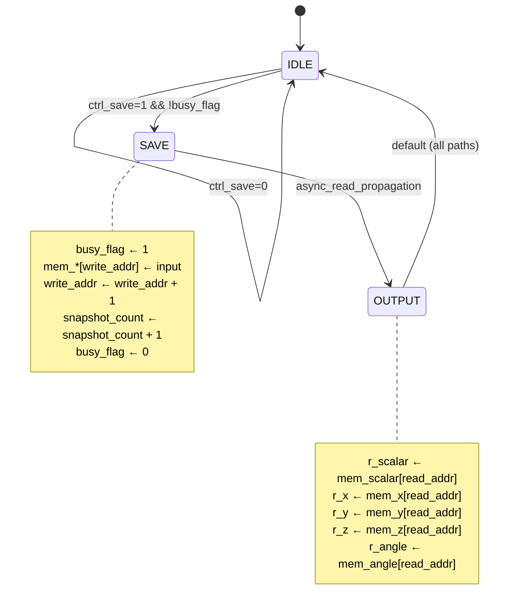

# Quaternion Memory Hardware — Mermaid Diagram

## System Architecture



## API Function Signatures (C)

```c
// Write a quaternion snapshot to FPGA memory
bool q_bank_add(float s, float x, float y, float z, float angle);
// Returns: true if write succeeded, false if full/busy
// Side effects: increments snapshot_count, auto-wraps write_addr at 1023

// Read a quaternion snapshot by index
void q_bank_read(uint32_t index, float *s, float *x, float *y, float *z, float *angle);
// Inputs: index in [0, 1023]
// Outputs: dereferenced floats from BRAM at that address
// Note: bit-casts uint32 BRAM values to IEEE 754 floats
```

## Hardware State Machine (Controller)



## Circular Buffer Behavior

| Operation | Behavior |
|-----------|----------|
| **Write (q_bank_add)** | Stores (s,x,y,z,θ) at write_addr; increments; wraps at 1024 |
| **Read (q_bank_read)** | Async lookup at read_addr; bit-casts FP; returns via pointers |
| **Capacity** | 1024 entries × 5 quaternion components × 32-bit each = 20 KB BRAM |
| **Overflow** | write_addr wraps silently; oldest entries overwritten |
| **Concurrency** | Busy flag prevents simultaneous write; reads are always safe |

## Data Flow Example

```
C Code (spacecraft.c):
┌─────────────────────────────┐
│ float q_s = 0.7071, ...    │
│ q_bank_add(q_s, ...);      │ ──┐
└─────────────────────────────┘   │
                                   ├─→ SimulatedHardwareBank
                                   │   (mirrors registers)
                                   │
                                   ├─→ Q_SCALAR ← uint32_bits(0.7071)
                                   │   Q_X ← uint32_bits(x)
                                   │   ...
                                   │
                                   ├─→ CTRL_REG ← 0x01 (pulse save)
                                   │
                                   └─→ QuaternionMemoryBank_Controller
                                       (hardware or simulation)
                                       
                                       mem_scalar[write_addr] ← 0x3f34a3d7
                                       mem_x[write_addr] ← ...
                                       mem_y[...] ← ...
                                       mem_z[...] ← ...
                                       mem_angle[...] ← ...
                                       
                                       write_addr ← (write_addr + 1) % 1024
                                       snapshot_count ← snapshot_count + 1

Later, retrieve:
┌──────────────────────────────┐
│ float s_read, x_read, ...;  │
│ q_bank_read(0, &s_read, ...);│ ──┐
└──────────────────────────────┘   │
                                    ├─→ READ_ADDR ← 0
                                    │
                                    └─→ R_SCALAR = mem_scalar[0]
                                        s_read ← float_bits(R_SCALAR)
                                        x_read ← float_bits(R_X)
                                        ...
```

## Key Design Decisions

1. **Dual BRAM blocks** (separate s, x, y, z, angle): allows parallel reads across all components
2. **Circular buffer**: no external management needed; write_addr wraps automatically
3. **Async reads**: no pipeline stall while writing
4. **Busy flag** (single bit): lightweight synchronization without spinlocks
5. **32-bit IEEE 754 floats**: hardware-native FP format, zero conversion cost
6. **C driver abstraction**: hides register complexity; one API call = one snapshot
